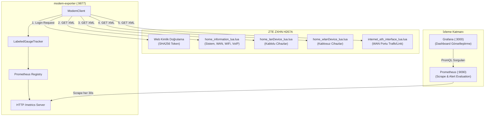

# ZTE ZXHN H267A Modem Exporter - Mimari ve Tasarım Dokümantasyonu

Bu doküman, **ZTE ZXHN H267A** fiber modem için geliştirilen Prometheus Exporter'ın iç çalışma prensiplerini, kimlik doğrulama akışını, XML parse etme mantığını ve hata toleransı mimarisini detaylandırmaktadır.

---

## 1. Genel Sistem Mimarisi



---

## 2. Kimlik Doğrulama ve Oturum Akışı (Authentication Flow)

ZTE ZXHN H267A modemi standart HTTP Basic Auth kullanmaz; web arayüzü tek kullanımlık token tabanlı SHA256 karma (hash) akışı yürütür.

```mermaid
sequenceDiagram
    autonumber
    participant Exporter as ModemClient
    participant Modem as ZTE H267A

    Exporter->>Modem: GET / (Oturum çerezi başlatma)
    Modem-->>Exporter: Set-Cookie: _TESTCOOKIESUPPORT=1

    Exporter->>Modem: GET /function_module/login_module/login_page/logintoken_lua.lua
    Modem-->>Exporter: <token_string> (örn: 18492048)

    Note over Exporter: Hash Hesaplama:<br/>SHA256(MODEM_PASSWORD + token_string)

    Exporter->>Modem: POST / (Username, Password=Hash, action=login)
    Modem-->>Exporter: Set-Cookie: SID=session_id; 200 OK

    Note over Exporter,Modem: Oturum Doğrulandı (is_logged_in = True)
```

### Oturum Dayanıklılığı ve Otomatik Yeniden Bağlanma (Session Recovery)
1. Her veri çekme isteğinde (`fetch_xml`), modemin döndüğü HTML incelenir.
2. Yanıtta `SessionTimeout` veya login formu tespit edilirse oturumun düştüğü anlaşılır.
3. `self.session.cookies.clear()` ile bayat oturum çerezleri temizlenir ve `login()` fonksiyonu otomatik tetiklenerek yarım kalan istek tekrarlanır.

---

## 3. XML Veri Ayrıştırma Mantığı (`parse_objects`)

Modemin döndürdüğü sayfalar standart hiyerarşik XML yerine ardışık `<paraname>` ve `<paravalue>` etiketlerinden oluşan düz (flat) bir yapı sunar.

### Örnek Modem Çıktısı:
```xml
<paraname>_InstID</paraname><paravalue>IGD.WD1.WDD1</paravalue>
<paraname>ConnStatus</paraname><paravalue>Connected</paravalue>
<paraname>UpTime</paraname><paravalue>86400</paravalue>
<paraname>_InstID</paraname><paravalue>IGD.WD1.WDD2</paravalue>
<paraname>ConnStatus</paraname><paravalue>Disconnected</paravalue>
```

### Ayrıştırma Algoritması:
* Kod her `_InstID` alanına rastladığında yeni bir nesne (dict) başlatır.
* Takip eden tüm alanlar bir sonraki `_InstID` görülene kadar geçerli nesneye anahtar-değer olarak eklenir.
* Bu sayede ağ cihazları, WiFi radyoları ve VoIP hatları nesne listelerine (`list[dict]`) dönüştürülür.

---

## 4. Dinamik Etiket Temizliği (`LabeledGaugeTracker`)

Prometheus Client kütüphanesi, etiketli metrikleri varsayılan olarak bellekten asla silmez. Ağdan ayrılan veya IP/Hostname değiştiren cihazlar temizlenmezse, eski seriler sonsuza dek `modem_device_active` metriğinde kalır (stale time series problemi).

### `LabeledGaugeTracker` Çözümü:
```python
# Her scrape döngüsünde:
current_keys = { (mac, hostname, ip, type) for device in active_devices }

# 1. Mevcut olanları güncelle
for row in active_devices:
    gauge.labels(*row.keys).set(row.value)

# 2. Önceki scrape'te olup şimdi olmayan serileri Prometheus'tan kaldır
for stale_key in previous_keys - current_keys:
    gauge.remove(*stale_key)

previous_keys = current_keys
```

---

## 5. Hata Toleransı ve İletişim Stratejisi

| Senaryo | İzlenen Yol | Üretilen Metrik / Log |
|---|---|---|
| **Modem Yanıt Vermiyor / Timeout** | `MODEM_TIMEOUT` süresince bekler, `urllib3` ile 2 kez yeniden dener. | `modem_scrape_errors_total{type="timeout"}` artar, `modem_scrape_success=0`. |
| **Oturum Düştü (Session Expired)** | `SessionTimeout` algılanır, çerezler sıfırlanıp login yinelenir. | `logger.warning("Session expired... Triggering re-login")` |
| **Kısmi Sayfa Hatası (örn. LAN devices sayfası arızalandı)** | Diğer sayfaların metrikleri işlenir, ilgili adımın hata sayacı artırılır. | `modem_scrape_errors_total{type="lan"}` artar. |
| **Container Kapatılıyor (`docker stop`)** | `SIGTERM` sinyali yakalanır, döngü sonlanır, soketler temizlenir. | `logger.info("Modem Exporter exited.")` |
